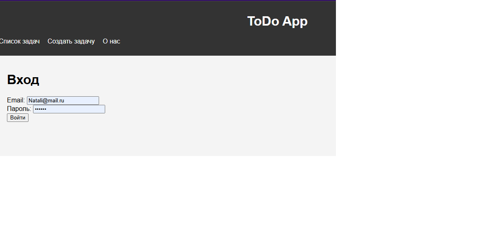
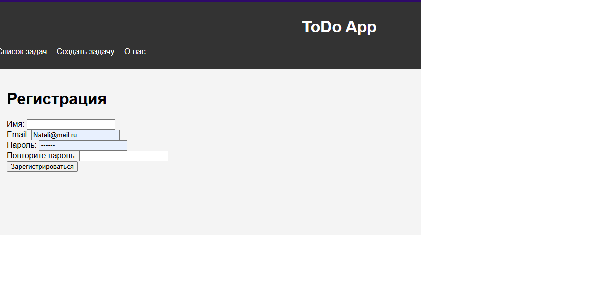
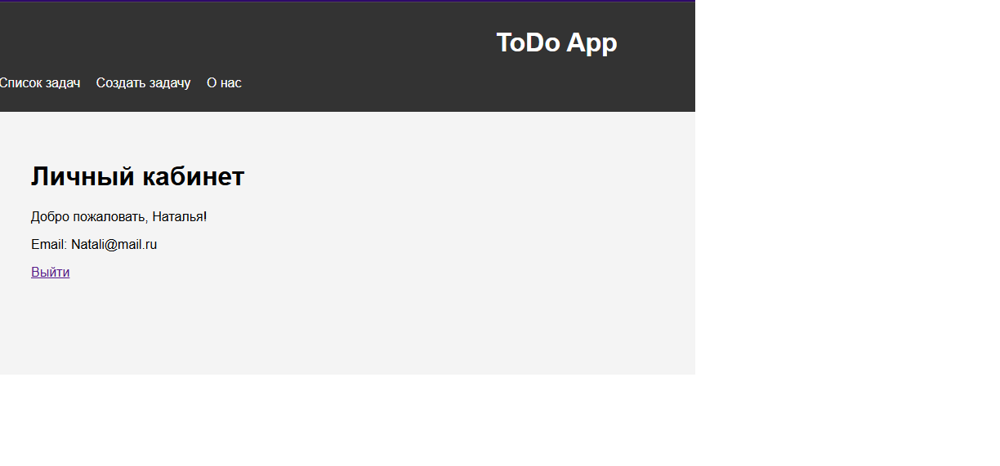

# Лабораторная работа №5 Компоненты безопасности в Laravel. 

## Цель работы

Познакомиться с основами компонентов безопасности в Laravel, таких как аутентификация, авторизация, защита от CSRF, а также использование встроенных механизмов для управления доступом. Освоить подходы к безопасной разработке, включая создание защищенных маршрутов и управление ролями пользователей.

### Задания

1. Создаем контроллер AuthController для управления аутентификацией пользователей.
php artisan make:controller AuthController
- `php artisan make:controller AuthController`

2. Добавляем методы для регистрации, входа и выхода пользователя.
```php
// Обработать данные входа
    public function login(Request $request)
    {
        $request->validate([
            'email' => 'required|email',
            'password' => 'required|string',
        ]);

        if (Auth::attempt($request->only('email', 'password'))) {
            $request->session()->regenerate();
            return redirect()->route('home')->with('success', 'Вы успешно вошли в систему.');
        }

        return back()->withErrors([
            'email' => 'Неверные учетные данные.',
        ])->onlyInput('email');
    }
// Выход из системы
    public function logout(Request $request)
    {
        Auth::logout();
        $request->session()->invalidate();
        $request->session()->regenerateToken();

        return redirect()->route('login')->with('success', 'Вы успешно вышли из системы.');
    }
 // Обработать данные регистрации
    public function register(Request $request)
    {
        $request->validate([
            'name' => 'required|string|max:255',
            'email' => 'required|email|unique:users|max:255',
            'password' => 'required|string|min:8|confirmed',
        ]);

        $user = User::create([
            'name' => $request->name,
            'email' => $request->email,
            'password' => bcrypt($request->password),
        ]);

        Auth::login($user);

        return redirect()->route('home')->with('success', 'Регистрация прошла успешно.');
    }
```
3. Создаем маршруты для регистрации, входа и выхода пользователя.
```php
 use App\Http\Controllers\AuthController;

// Форма входа
Route::get('/login', [AuthController::class, 'showLoginForm'])->name('login');
Route::post('/login', [AuthController::class, 'login']);

// Выход
Route::post('/logout', [AuthController::class, 'logout'])->name('logout');

// Форма регистрации
Route::get('/register', [AuthController::class, 'showRegistrationForm'])->name('register');
Route::post('/register', [AuthController::class, 'register']);
```
4. Обновляем представления для форм регистрации и входа..





5. Создаем отдельный класс Request для валидации данных при регистрации или входе.

```php
      public function storeRegister(Request $request)
{
    $validated = $request->validate([
        'name' => 'required|string|min:3|max:50',
        'email' => 'required|string|email|max:255|unique:users,email',
        'password' => 'required|string|min:6|confirmed',
    ]);

    User::create([
        'name' => $validated['name'],
        'email' => $validated['email'],
        'password' => Hash::make($validated['password']),
    ]);
    public function storeLogin(Request $request)
    {
        $request->validate([
            'email' => 'required|email',
            'password' => 'required|string',
        ]);}}
```
6. Установливаем библиотеку Laravel Breeze для быстрой настройки аутентификации. 
- `composer require laravel/breeze --dev`
7. Реализуем страницу "Личный кабинет", доступ к которой имеют только авторизованные пользователи.

```php
<!-- resources/views/profile/index.blade.php -->
@extends('layouts.app')

@section('content')
    <div class="container">
        <h1>Личный кабинет</h1>
        <p>Добро пожаловать, {{ $user->name }}!</p>
        <p>Email: {{ $user->email }}</p>

        <a href="{{ route('logout') }}" onclick="event.preventDefault(); document.getElementById('logout-form').submit();">
            Выйти
        </a>

        <form id="logout-form" action="{{ route('logout') }}" method="POST" style="display: none;">
            @csrf
        </form>
    </div>
@endsection
```


8. Настраиваем проверку доступа к данной странице, добавив middleware auth в маршрут.

```php
//cabinet
Route::middleware(['auth'])->get('/dashboard', [ProfileController::class, 'index'])->name('dashboard');
Route::middleware('auth')->group(function () {
Route::get('/profile', [ProfileController::class, 'index'])->name('profile.index');
// Для администраторов
Route::middleware('admin')->get('/admin/users', [AdminController::class, 'index'])->name('admin.users');});
```
9. Добавляем защиту от CSRF-атак на формах.

## Контрольные вопросы
1. Какие готовые решения для аутентификации предоставляет Laravel? Laravel предоставляет встроенные механизмы для аутентификации пользователей, которые можно легко использовать: Laravel Breeze, Laravel Jetstream, Laravel Fortify, Laravel Sanctum, Laravel Passport.
2. Какие методы аутентификации пользователей вы знаете? Форма входа с логином и паролем, Одноразовые пароли (OTP), Токен-авторизация, Двухфакторная аутентификация (2FA), Аутентификация через социальные сети.
3. Чем отличается аутентификация от авторизации? Аутентификация отвечает за то, чтобы убедиться, кто пользователь, а авторизация — за то, чтобы определить, что он может делать.
4. Как обеспечить защиту от CSRF-атак в Laravel? Использовать CSRF-токены, Middleware защита
